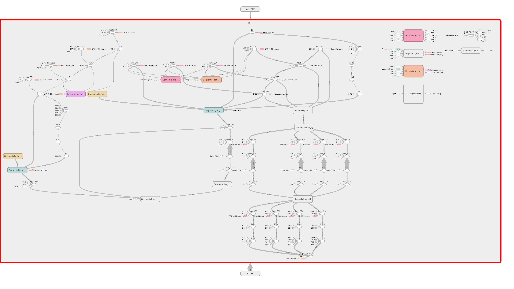

This file, tensorboard_view.py, contains the code to obtain logs for TensorBoard in order to view the TCP graph. The latest logs can be found in the runs/TCP_experiment folder.

The following image showcases the TCP graph obtained from TensorBoard:

> :warning: **Please make sure to use TensorBoard version 2.5 or higher. Earlier versions may have issues with the download PNG functionality, which might not work properly.**
